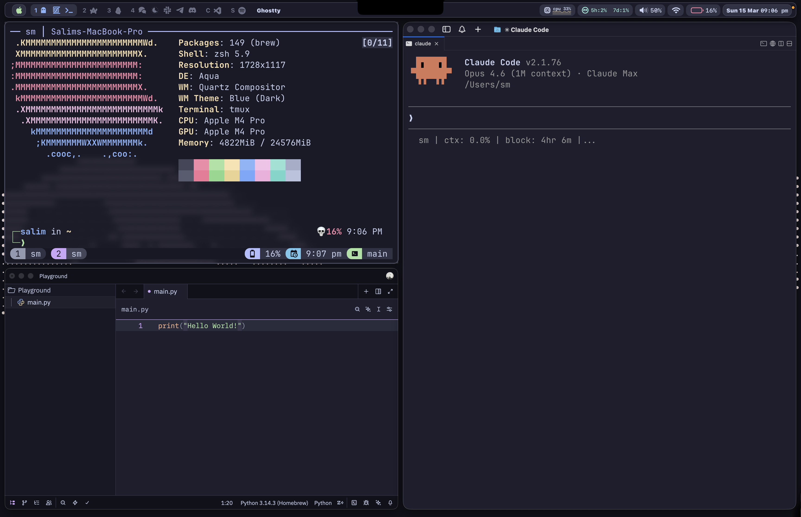
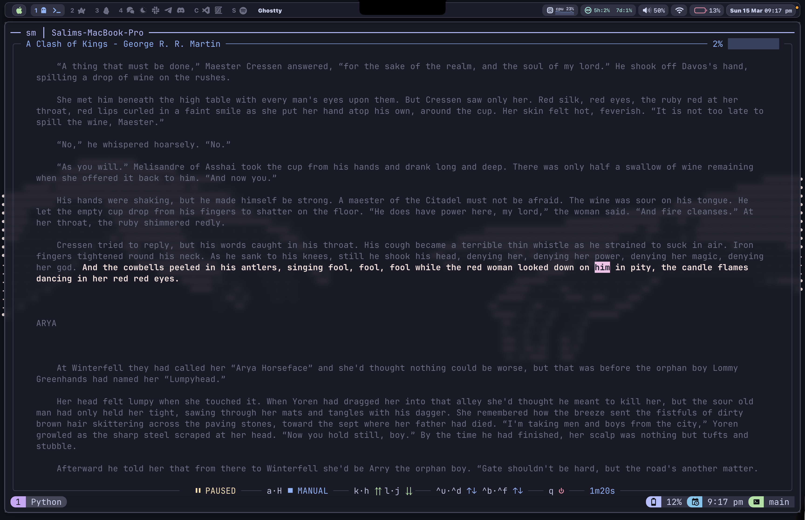
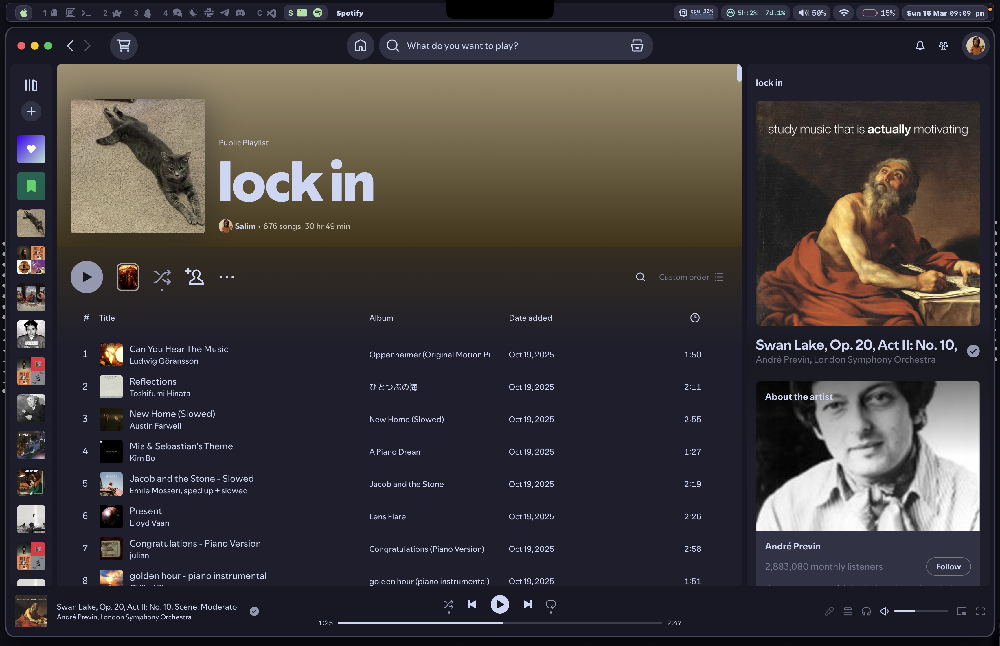

# Salim's Dotfiles

My macOS development environment. Terminal-first, keyboard-driven, and themed end-to-end with [Catppuccin Mocha](https://github.com/catppuccin/catppuccin).

[](https://www.apple.com/macos/)
[](LICENSE)
[](https://github.com/catppuccin/catppuccin)



> Tiling windows with AeroSpace, a Lua-powered status bar, Ghostty + tmux for terminal life, Zed for code, and offline TTS audiobook reading — all wired together with vim keybindings.

## What's Inside

| Tool | Purpose | Config |
|------|---------|--------|
| [AeroSpace](https://github.com/nikitabobko/AeroSpace) | Tiling window manager | `aerospace/` |
| [Sketchybar](https://github.com/FelixKratz/SketchyBar) | Custom status bar | `sketchybar/` |
| [Ghostty](https://ghostty.org) | Terminal emulator | `ghostty/` |
| [tmux](https://github.com/tmux/tmux) | Terminal multiplexer | `tmux/` |
| [Zed](https://zed.dev) | Primary editor | `zed/` |
| [Neovim](https://neovim.io) | Quick terminal editing (LazyVim) | `nvim/` |
| [Zsh](https://www.zsh.org) | Shell | `zsh/` |
| [Starship](https://starship.rs) | Prompt | `starship.toml` |
| [Lue](https://github.com/superstarryeyes/lue) | Terminal eBook reader with TTS | `lue/` |
| [JankyBorders](https://github.com/FelixKratz/JankyBorders) | Window borders | `borders/` |
| [Spicetify](https://spicetify.app) + [SpotX](https://github.com/SpotX-Official/SpotX-Bash) | Spotify theming + ad blocking | `spicetify/` |
| [Brewfile](https://github.com/Homebrew/homebrew-bundle) | Package management | `Brewfile` |

## Architecture

The tools form a tightly integrated stack:

```
Zed (primary editor) / Neovim (quick terminal edits)
Ghostty (terminal) → auto-launches tmux → runs Zsh + Starship prompt
     ↓                      ↓
  Cmd+key          Ctrl+a prefix (which-key menu)
  passthrough              ↓
  to tmux           Lazygit / fzf popups / Lue (eBook reader)
```

**Design principles:**
- Catppuccin Mocha theme across every tool
- Vim-style `hjkl` navigation everywhere (AeroSpace, tmux, Lue, Zed)
- Modal keybindings with leader/prefix keys
- Minimal UI chrome, maximum content space
- Frosted glass transparency on the terminal

---

## AeroSpace (Window Manager)

Tiling window manager with vim-style navigation using `Alt` as the modifier key.

- **Navigation:** `Alt+h/j/k/l` to move focus between windows
- **Move windows:** `Alt+Shift+h/j/k/l` to swap window positions
- **Workspaces:** `Alt+1-4` to switch, `Alt+Shift+1-4` to move windows
- **Layouts:** `Alt+/` (tiles), `Alt+,` (accordion), `Alt+f` (floating toggle)
- **Resize:** `Alt+Shift+-/=` for quick resize, `Alt+r` enters resize mode with fine control
- **Service mode:** `Alt+Shift+;` for admin operations (reset layout, balance sizes, close others)
- **Gaps:** 10px inner, 10-15px outer
- **Floating rules:** Finder, System Settings, iPhone Mirroring, games, and other non-tileable apps
- **Auto-routing:** Apps auto-move to assigned workspaces (Ghostty→1, Browsers→2, Obsidian→3, Messaging→4, IDEs→C, Spotify→S)
- **Integration:** Sends workspace change events to Sketchybar for live workspace indicators
- **Follow-floats:** Floating apps (Finder, System Settings, etc.) follow you across workspaces

## Ghostty (Terminal)

GPU-accelerated terminal with frosted glass aesthetics.

- **Theme:** Catppuccin Mocha
- **Font:** JetBrainsMono Nerd Font, size 18
- **Window:** 70% opacity, 20px blur radius, no title bar or window decoration
- **Shell integration:** Auto-launches `tmux new-session -A -s main` (attaches to existing or creates new)
- **Cursor:** Blinking block

**Cmd+key passthrough to tmux** (Ghostty translates macOS-native shortcuts into escape sequences tmux understands):

| Shortcut | Action |
|----------|--------|
| `Cmd+1-9` | Switch tmux window 1-9 |
| `Cmd+t` | New tmux window |
| `Cmd+w` | Close tmux pane |
| `Cmd+d` | Split vertical |
| `Cmd+Shift+d` | Split horizontal |
| `Cmd+Shift+Enter` | Zoom pane |
| `Cmd+e` | Window tree |
| `Cmd+Shift+w` | Session picker |

## tmux

Terminal multiplexer with session persistence and a which-key menu for discoverability.

- **Prefix:** `Ctrl+a`
- **Theme:** Catppuccin Mocha (v2.1.3) with battery + time in status bar
- **History:** 50,000 lines
- **Mouse:** Enabled
- **Windows/panes:** Start at index 1 (not 0)
- **Window naming:** Auto-shows current directory name, with special handling for versioned tools

**Which-key menu** (`Ctrl+a Space`): Opens a categorized menu with all available keybindings organized under Copy, Windows, Panes, Buffers, Sessions, and Client submenus.

**Key bindings (with prefix):**

| Binding | Action |
|---------|--------|
| `h/j/k/l` | Navigate panes (vim-style) |
| `s` / `v` | Split vertical / horizontal |
| `Space` | Which-key menu |
| `g` | Popup lazygit (floating overlay) |
| `w` | Window/session tree |
| `W` | fzf session picker (fuzzy search) |
| `N` | New named session |
| `Ctrl+t` | Scratch terminal (persistent) |
| `z` | Switch to rehoboam control session |
| `R` | Reload config |

**Plugins (via TPM):**
- `tmux-resurrect` + `tmux-continuum` — auto-save sessions every 15 min, restore on start
- `tmux-yank` — clipboard integration
- `tmux-battery` — battery widget in status bar
- `catppuccin/tmux` — theme
- `tmux-which-key` — Space-triggered categorized menu

**Pane borders:** Shows current directory and pane title at the top of each pane.

## Neovim

My primary editors are VS Code and Cursor, but Neovim is kept configured for quick terminal editing when I need to jump into a file without leaving the terminal. LazyVim-based, focused on distraction-free editing.

- **Framework:** [LazyVim](https://www.lazyvim.org/) with selective customization
- **Diagnostics:** All sign column indicators hidden (clean gutter)

**Plugins:**

| Plugin | Purpose | Key binding |
|--------|---------|-------------|
| `lazygit.nvim` | Git UI in floating window | `<leader>lg` |
| `smart-splits.nvim` | Seamless vim-tmux pane navigation | `Ctrl+h/j/k/l` |
| `neo-tree.nvim` | File explorer with git status | LazyVim default |
| `blink.cmp` | Completion engine (disabled in Markdown) | Auto |
| `toggleterm.nvim` | Integrated terminal splits | `Ctrl+\`, `<leader>r` (run file) |
| `obsidian.nvim` | Obsidian vault integration | `<leader>o` prefix |

**toggleterm** supports running the current file with `<leader>r` — auto-detects Python, Node, Lua, Bash, and Zsh.

**Obsidian integration:**
- Workspace: `~/Learn/Notes/Main`
- Daily notes in `2 - Source Material/Leetcode/` with date format `%B %d %Y`
- Custom daily regimen template with time-blocked schedule (Morning/Afternoon/Evening)
- Keybindings: `<leader>ot` (today), `<leader>oy` (yesterday), `<leader>od` (daily regimen), `<leader>os` (search), `<leader>on` (new note)

## Zsh + Starship

Zsh shell with XDG-compliant config directory and Starship prompt.

**Shell architecture:**
- `home/.zshenv` → sets `ZDOTDIR=~/.config/zsh` (redirects all zsh config to XDG location)
- `zsh/.zshenv` → adds `~/.local/bin` to PATH
- `zsh/.zprofile` → initializes Homebrew, loads OrbStack integration
- `zsh/.zshrc` → sources config modules, sets aliases, adds tool paths

**Config modules:**
- `config/prompt.zsh` — Starship prompt init
- `config/zoxide.zsh` — Smart directory jumping (frecency-based `cd` replacement)
- `config/completion.zsh` — Zsh autosuggestions (Fish-like, history + completion strategy)

**Custom aliases & functions:**
- `tb` — Launch tmux-boot (interactive project session picker)
- `rh` — Switch to rehoboam control session
- `tka` — Kill all tmux sessions, clear resurrect state, close Ghostty
- `book` — Fuzzy-search Calibre library and open in Lue (sorted by recently read, hides books tagged "hidden")
- `c` — Shortcut for `claude`

**Starship prompt:**
- Two-line format with green bracket styling
- Shows: directory (truncated to 3 levels), git branch + status, language versions (Python/Rust/Go/Node)
- Right side: battery status (color-coded), command duration (if >2s), time (12-hour)
- Git status symbols for conflicts, ahead/behind, diverged, modified, staged, renamed, deleted
- Green `❯` on success, red `❯` on error

## Sketchybar

Lua-based status bar with real-time system monitoring.

- **Theme:** Catppuccin Mocha with semi-transparent dark background
- **Height:** 32px, positioned at top
- **Fonts:** SF Pro (text), SF Mono (numbers), SF Symbols (icons)
- **AeroSpace integration:** Custom module queries AeroSpace via Unix domain socket for live workspace state

**Widgets:** Workspace indicators, front app name, WiFi, CPU, battery, volume, media controls, clock

## JankyBorders (Window Borders)

- **Active window:** White border (`#ffffff`)
- **Inactive window:** Muted dark gray (`#494d64`)
- **Style:** Rounded (radius 6.0), rendered above windows
- **Excluded:** Screen Studio

## Lue (eBook Reader)



Terminal-based eBook reader with offline TTS, integrated with Calibre library.

- **TTS:** Kokoro (offline, 82M params) with `af_heart` voice at 1.4x default speed
- **Theme:** Catppuccin Mocha — custom highlighting with Rosewater (active sentence), Pink (current word)
- **Keybindings:** Vim-style (`lue/keys.json`) — `h/j/k/l` for sentence/paragraph navigation, `H/G/g` for jumps
- **Playback:** Space/p for play/pause, `,`/`.` to adjust speed, `s`/`w` to toggle highlights
- **Session timer:** Built-in reading timer in the bottom bar
- **Calibre integration:** `book` shell command (in `.zshrc`) that queries Calibre's SQLite database, filters hidden-tagged books, sorts by recently read, and opens a fuzzy picker via fzf

## Zed (Editor)

Primary code editor, configured at `zed/settings.json`.

## Spicetify + SpotX (Spotify)



- **Theme:** Catppuccin Mocha via the marketplace
- **SpotX:** Ad blocking with auto-update blocker
- CSS injection enabled, custom apps (marketplace), experimental features
- Managed via `/spotify` skill: SpotX first (patches executable), then Spicetify (layers UI)

## Alcove (Dynamic Island)

[Alcove](https://github.com/TheBoredTeam/Alcove) adds a Dynamic Island-style notch area to macOS. It lives behind the MacBook notch and activates on hover or system events, showing:

- **Media controls** — album art, play/pause, skip (appears when music is playing)
- **Volume/brightness** — visual sliders that pop up on adjustment
- **Power status** — battery and charging info on cable connect/disconnect

Alcove runs as a menu bar app and requires no configuration — it works out of the box with the system notch.

## macOS Defaults

The `macos/defaults.sh` script configures system preferences:

- **Keyboard:** 2x faster key repeat, no auto-correct, no smart quotes/dashes
- **Trackpad:** Tap to click, three-finger drag
- **Finder:** Show hidden files + all extensions, path bar, list view by default, search current folder, no .DS_Store on network/USB volumes, show ~/Library
- **Dock:** 48px icons, don't auto-rearrange Spaces, hide recent apps
- **Screenshots:** Save to ~/Downloads, PNG format, no shadows
- **Hot corners:** Top-left → Mission Control
- **Menu bar:** Battery percentage, custom time format
- **Activity Monitor:** All processes, sort by CPU usage

---

## Keybinding Reference

### Window Management (AeroSpace — Alt modifier)

| Binding | Action |
|---------|--------|
| `Alt+h/j/k/l` | Focus window left/down/up/right |
| `Alt+Shift+h/j/k/l` | Move window left/down/up/right |
| `Alt+1-4,C,S` | Switch to workspace |
| `Alt+f` | Toggle floating |
| `Alt+/` | Tiles layout |
| `Alt+,` | Accordion layout |
| `Alt+r` | Enter resize mode |

### Terminal (Ghostty Cmd → tmux)

| Binding | Action |
|---------|--------|
| `Cmd+t` | New window |
| `Cmd+w` | Close pane |
| `Cmd+d` / `Cmd+Shift+d` | Split vertical / horizontal |
| `Cmd+1-9` | Switch window |
| `Cmd+Shift+Enter` | Zoom pane |

### tmux (Ctrl+a prefix)

| Binding | Action |
|---------|--------|
| `Space` | Which-key menu |
| `h/j/k/l` | Navigate panes |
| `g` | Popup lazygit |
| `w` / `W` | Window tree / fzf session picker |
| `Ctrl+t` | Scratch terminal |

### Neovim

| Binding | Action |
|---------|--------|
| `Ctrl+h/j/k/l` | Navigate splits (works across tmux) |
| `<leader>lg` | Lazygit |
| `<leader>r` | Run current file |
| `<leader>o...` | Obsidian commands |
| `Ctrl+\` | Toggle terminal |

---

## Custom Scripts

### tmux-boot (`scripts/bin/tmux-boot`)

Interactive project session launcher using `gum` for terminal UI.

- Reads project definitions from `~/.config/claude-hooks/projects.json`
- Sorts projects by zoxide frecency scores
- Multi-select with `gum choose` (Catppuccin-styled)
- Each selected project gets its own tmux session with `claude` running
- Always boots a "rehoboam" control session first
- Usage: `tmux-boot` (interactive), `tmux-boot --all`, `tmux-boot --list`

### nvim-clean-swaps (`scripts/bin/nvim-clean-swaps.sh`)

Automatically cleans orphaned Neovim swap files on shell startup. Runs silently in the background.

---

## Installation

### Quick Start

```bash
git clone https://github.com/salimmohamed/dotfiles.git ~/dotfiles
cd ~/dotfiles
./scripts/bootstrap.sh
```

### What the Bootstrap Does

1. Installs Homebrew (if missing)
2. Installs all packages from the Brewfile
3. Backs up existing dotfiles to `~/.dotfiles-backup-[timestamp]/`
4. Creates symlinks:
   - `~/.config` → `~/dotfiles`
   - `~/.zshrc` → `~/dotfiles/home/.zshrc`
   - `~/.zshenv` → `~/dotfiles/home/.zshenv`
5. Installs user scripts to `~/.local/bin/`
6. Installs TPM and tmux plugins
7. Optionally applies macOS system defaults

### Options

```bash
./scripts/bootstrap.sh --dry-run     # Preview without changes
./scripts/bootstrap.sh --skip-brew   # Skip Homebrew
./scripts/bootstrap.sh --skip-macos  # Skip macOS defaults
```

### Automated Setup with Claude Code

See [SETUP.md](SETUP.md) for step-by-step instructions that Claude Code can follow to fully replicate this environment on a fresh Mac.

---

## Brewfile Summary

**Taps:** Sketchybar/Borders (FelixKratz), AeroSpace, Bun, Supabase, Rehoboam

**CLI Tools:** git, neovim (HEAD), ripgrep, fd, fzf, jq, lazygit, tmux, starship, zoxide, zsh-autosuggestions, gh, awscli, tailscale

**Languages:** Python 3.14, Node, Rust, Lua, Bun

**Applications:** Ghostty, Zed, Cursor, VSCode, AeroSpace, Alt-Tab, Raycast, Shottr, HiddenBar, AppCleaner, Screen Studio, Zoom, Parsec, Microsoft Office

**Fonts:** JetBrainsMono Nerd Font, SF Mono, SF Pro

**44 VSCode extensions** including Claude Code, Catppuccin theme, GitLens, Copilot, Vim, Python/C++ tools, LaTeX, REST client

---

## Structure

```
~/.config/                         # This repository
├── aerospace/                     # Tiling window manager
│   ├── aerospace.toml             # Main config + keybindings
│   ├── follow-floats.sh           # Floating window helper
│   └── watch-reload.sh            # Auto-reload on config change
├── borders/
│   └── bordersrc                  # Window border styling
├── gh/
│   └── config.yml                 # GitHub CLI preferences
├── ghostty/
│   └── config                     # Terminal theme, font, keybindings
├── git/
│   └── ignore                     # Global gitignore
├── home/                          # Files symlinked to ~/
│   ├── .zshrc                     # → ~/.zshrc
│   ├── .zshenv                    # → ~/.zshenv (sets ZDOTDIR)
│   └── .bashrc                    # → ~/.bashrc
├── lue/                           # Terminal eBook reader
│   └── keys.json                  # Vim-style keyboard shortcuts
├── macos/
│   └── defaults.sh                # macOS system preferences script
├── nvim/                          # Neovim (LazyVim)
│   ├── init.lua                   # Entry point
│   ├── lua/config/                # Options, keymaps, autocmds
│   └── lua/plugins/               # Plugin configs
├── scripts/
│   ├── bootstrap.sh               # Main installer
│   ├── symlink.sh                 # Symlink manager
│   ├── backup.sh                  # Backup utility
│   └── bin/                       # tmux-boot, nvim-clean-swaps
├── sketchybar/                    # Status bar (Lua-based)
│   ├── init.lua                   # Entry point
│   ├── bar.lua                    # Bar appearance
│   ├── colors.lua                 # Catppuccin Mocha palette
│   ├── settings.lua               # Font and spacing
│   ├── aerospace.lua              # Workspace integration
│   └── items/                     # Individual widgets
├── spicetify/                     # Spotify theming
│   ├── config-xpui.ini            # Spicetify settings
│   ├── CustomApps/                # Marketplace app
│   └── Themes/                    # Catppuccin theme files
├── tmux/
│   ├── tmux.conf                  # Main config + plugins
│   └── which-key-config.yaml      # Which-key menu structure
├── zed/                           # Zed editor
│   └── settings.json              # Editor preferences
├── zsh/
│   ├── .zshrc                     # Interactive shell config (includes book command)
│   ├── .zshenv                    # Environment variables
│   ├── .zprofile                  # Login shell (Homebrew init)
│   └── config/                    # Modules (prompt, zoxide, completion)
├── catppuccin-mocha.md            # Full color palette reference
├── starship.toml                  # Prompt configuration
├── Brewfile                       # Homebrew packages
├── SETUP.md                       # Claude Code automated setup guide
└── LICENSE                        # MIT
```

---

## Inspiration & Credits

- [FelixKratz/dotfiles](https://github.com/FelixKratz/dotfiles) — Sketchybar + AeroSpace reference
- [Tnixc/dots](https://github.com/Tnixc/dots)
- [tnixc/nix-config](https://github.com/tnixc/nix-config)
- [khaneliman/dotfiles](https://github.com/khaneliman/dotfiles)
- [ris-tlp/dotfiles](https://github.com/ris-tlp/dotfiles)
- [Mathias Bynens' dotfiles](https://github.com/mathiasbynens/dotfiles) — macOS defaults
- [Holman's dotfiles](https://github.com/holman/dotfiles)
- [Dotfiles GitHub Guide](https://dotfiles.github.io/)

## License

MIT — feel free to use anything here as inspiration for your own setup.
